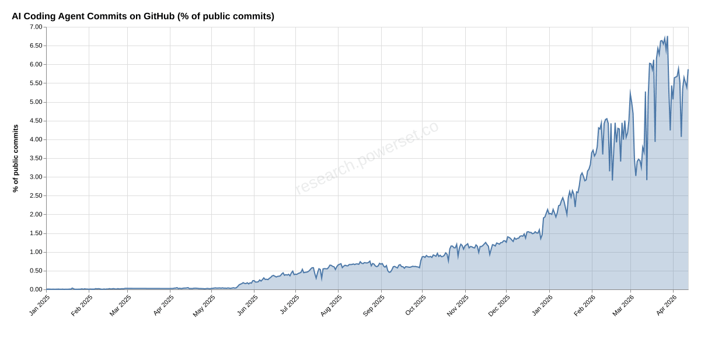

# GitHub Coding Agent Monitor

A public, auditable log of AI coding agent commit counts on GitHub over time.
The following chart and table are updated automatically by a GitHub Action running on a daily schedule.



<!-- recent-table-start -->

| Agent          | % of public commits |
| -------------- | ------------------- |
| Claude Code    | 2.87%               |
| Cursor         | 0.45%               |
| GitHub Copilot | 0.36%               |
| Google Jules   | 0.08%               |
| Devin AI       | 0.01%               |
| Aider          | 0.00%               |
| OpenCode       | 0.00%               |
| Amazon Q       | 0.00%               |
| OpenAI Codex   | 0.00%               |

<!-- recent-table-end -->

## Detected Agents

| Agent               | Search Query                          |
| ------------------- | ------------------------------------- |
| Claude Code         | `noreply@anthropic.com`               |
| GitHub Copilot      | `author:copilot-swe-agent[bot]`       |
| Devin AI            | `author:devin-ai-integration[bot]`    |
| Aider               | `aider.chat`                          |
| OpenAI Codex        | `author:chatgpt-codex-connector[bot]` |
| OpenCode            | `noreply@opencode.ai`                 |
| Cursor (Editor)     | `cursoragent@cursor.com`              |
| Cursor (Background) | `author-email:agent@cursor.com`       |
| Google Jules        | `author:google-labs-jules[bot]`       |
| Amazon Q            | `author:amazon-q-developer[bot]`      |

## How It Works

A daily GitHub Action uses the [GitHub Search API](https://docs.github.com/en/rest/search/search#search-commits) to count public commits matching each agent's signature. Total public commits are counted in 24x 1-hour windows (to stay under the 1M `total_count` ceiling) and summed.

Results are stored as flat CSVs in `data/YYYY-MM-DD.csv` and committed back to this repo.

## Query the Data with DuckDB

```sql
SELECT * FROM read_csv('data/*.csv');
```

```sql
-- Daily agent percentages
SELECT
  date,
  query AS agent,
  count,
  count * 100.0 / SUM(count) FILTER (WHERE query = 'total') OVER (PARTITION BY date) AS pct
FROM read_csv('data/*.csv')
WHERE query NOT LIKE 'total%'
ORDER BY date, count DESC;
```

## Run Locally

```bash
# Fetch a single day
GITHUB_TOKEN=ghp_... bun run src/fetch.ts 2026-02-14

# Fetch a date range (inclusive)
GITHUB_TOKEN=ghp_... bun run src/fetch.ts 2025-02-17 2026-02-15

# Generate chart from existing data
bun run src/chart.ts
```

## Backfill

At ~30 requests/min (GitHub search API rate limit), each day requires 34 queries (24 hourly windows + 10 agents), so backfilling runs at ~1 day/minute (~6 hours for a full year).

```bash
GITHUB_TOKEN=ghp_... bun run src/fetch.ts 2025-02-17 2026-02-15
```

## Caveats

- GitHub's `total_count` for search results is an **approximation** and may vary between requests
- Agents that allow users to opt out of attribution may be undercounted
- Only commits on default branches are indexed by GitHub's search
- The total commit count uses 1-hour windows to avoid hitting the 1M result ceiling

## License

MIT
