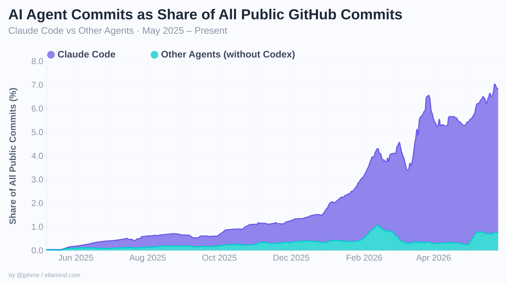
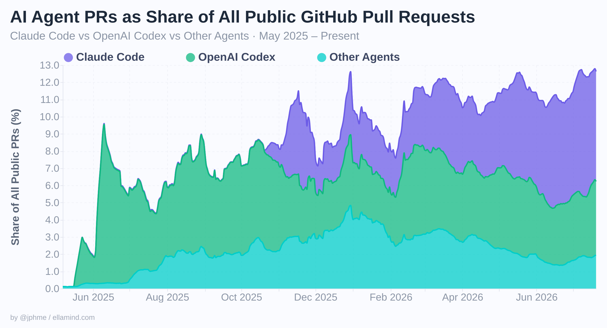
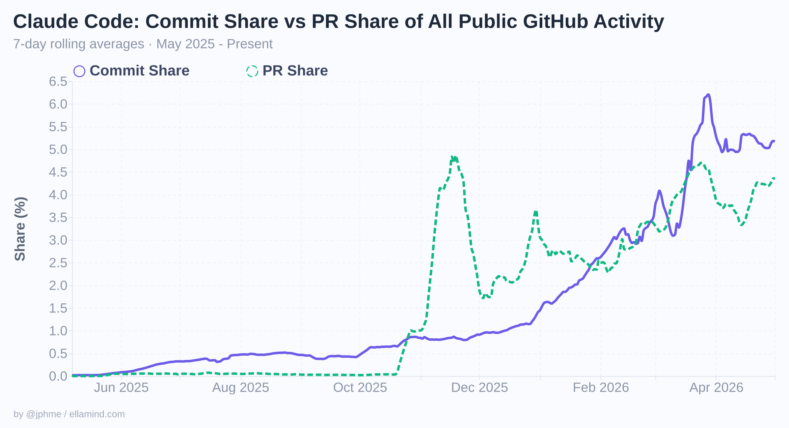
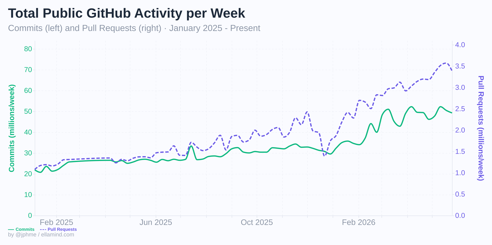

# GitHub Coding Agent Monitor

A public, auditable log of AI coding agent commit and PR counts on public GitHub repos over time.
The following charts and table are updated automatically by GitHub Actions running on a daily schedule.

## Commit Share



## PR Share



## Claude Code: Commits vs PRs



## Total GitHub Activity



<!-- recent-table-start -->

10-day rolling average, as a % of all public commits on GitHub of the top 3 coding agents (by detected commit count).

| Agent          |                      | %     |
| -------------- | -------------------- | ----- |
| Claude Code    | ████████████████████ | 5.65% |
| GitHub Copilot | █                    | 0.26% |
| Google Jules   |                      | 0.06% |

<!-- recent-table-end -->

## Caveats

Given the methodology described below, there are some implicit limits to this data:

1. Only public GitHub activity is monitored, private repos are not accessible by the queries used.
2. Only commits where a coding agent has left a "signature" can be detected (e.g. `Co-Authored-By: Claude Opus 4.6 <noreply@anthropic.com>`).
3. Only commits on default branches are indexed by GitHub's search.

Some coding agents may be more prevalent in private repos vs public repos. Some may not show up much in this data because they don't leave a "signature."
As such, be wary of what you conclude from this data.

In general, the data is meant to highlight broad trends around coding agent adoption overall.

We'd welcome more companies and developers to leave signatures in their commits so we can track this for the community. Additionally, we'd welcome any contributions to this repo to improve how data is collected, additional analysis, or other improvements.

## How It Works

A daily GitHub Action uses the [GitHub Search API](https://docs.github.com/en/rest/search/search#search-commits) to count new public commits matching each coding agent's signature. Total public commits are counted in 24x 1-hour windows and summed.

Results are stored as flat CSVs in `commit-data-raw/YYYY-MM-DD.csv` (raw) and `commit-data/YYYY-MM-DD.csv` (corrected for outliers), and committed back to this repo, along with updated charts.

Specific coding agents are detected using the following search queries:

| Agent               | Search Query                          |
| ------------------- | ------------------------------------- |
| Claude Code         | `noreply@anthropic.com`               |
| GitHub Copilot      | `author:copilot-swe-agent[bot]`       |
| Devin AI            | `author:devin-ai-integration[bot]`    |
| Aider               | `aider.chat`                          |
| OpenAI Codex        | `author:chatgpt-codex-connector[bot]` |
| OpenCode            | `noreply@opencode.ai`                 |
| Cursor (Editor)     | `cursoragent@cursor.com`              |
| Cursor (Background) | `author-email:cursoragent@cursor.com` |
| Google Jules        | `author:google-labs-jules[bot]`       |
| Amazon Q            | `author:amazon-q-developer[bot]`      |
| Amp (Sourcegraph)   | `amp@ampcode.com`                     |
| Windsurf            | `windsurf@codeium.com`                |
| JetBrains Junie     | `author:jetbrains-junie[bot]`         |

## Query the Data with DuckDB

Since the data lives in this repo in CSV files, you can use [DuckDB](https://duckdb.org/) to query it.

```sql
SELECT * FROM read_csv('commit-data/*.csv');
```

```sql
-- Daily agent percentages
SELECT
  date,
  query AS agent,
  count,
  count * 100.0 / SUM(count) FILTER (WHERE query = 'total') OVER (PARTITION BY date) AS pct
FROM read_csv('commit-data/*.csv')
WHERE query NOT LIKE 'total%'
ORDER BY date, count DESC;
```

## Run Locally

```bash
# Fetch a single day
GITHUB_TOKEN=ghp_... bun run src/fetch-commits.ts 2026-02-14

# Fetch a date range (inclusive)
GITHUB_TOKEN=ghp_... bun run src/fetch-commits.ts 2025-02-17 2026-02-15

# Apply outlier correction
uv run python3 src/fix_commit_totals.py --apply

# Generate charts from existing data
bun run src/chart.ts
bun run src/commit-share-chart.ts
bun run src/pr-share-chart.ts
bun run src/claude-dual-chart.ts
uv run python3 src/generate_weekly_summary.py
bun run src/total-activity-chart.ts
```

## Backfill

At ~30 requests/min (GitHub search API rate limit), each day requires 37 queries (24 hourly windows + 13 agents), so backfilling runs at ~1 day/minute (~6 hours for a full year).

```bash
GITHUB_TOKEN=ghp_... bun run src/fetch-commits.ts 2025-02-17 2026-02-15
```
